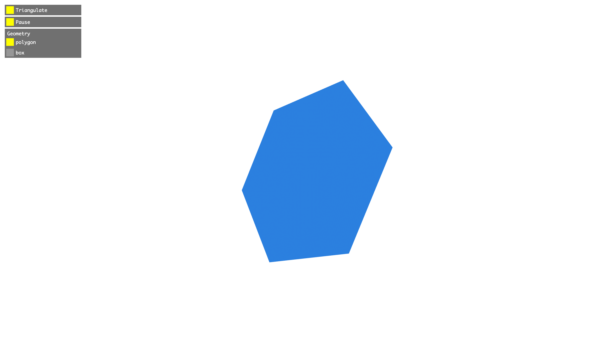

# geom-triangulate

Splits quad or polygon faces into triangles.

Implemented using naive face triangulation - builds a triangle fan anchored at the first face vertex.



## Installation

```bash
npm install geom-triangulate
```

## Usage

```js
import triangulate from "geom-triangulate";

const faces = [
  [0, 1, 2, 3],
  [3, 2, 5, 4],
  // ...
];

// Compute cells
const triangulatedCells = triangulate(faces); // [[0, 1, 2], [0, 2, 3], ...]
```

## API

#### `triangulate(faces, [stride]): cells`

**Parameters**

- faces: `TypedArray|Array` - list of face indices e.g. `new Uint32Array([a, b, c, d, a, b, c, d, ...]) or [[0,1,2,3], [3,2,5,4],...]`
- stride (optional): number - a stride for flat array faces.

_Note: "stride" assumes data is packed and all polygons are the same size. For arrays of face array, face.length will be used._

**Returns**

- cells: `TypedArray|Array` – simplicial complex geometry cells (eg. `new Uint32Array([a, b, c, a, b, c, ...])/new Array(a, b, c, a, b, c, ...)` or `new Array([a, b, c], [a, b, c], ...)`)

## License

MIT. See [license file](https://github.com/vorg/geom-triangulate/blob/master/LICENSE.md).
